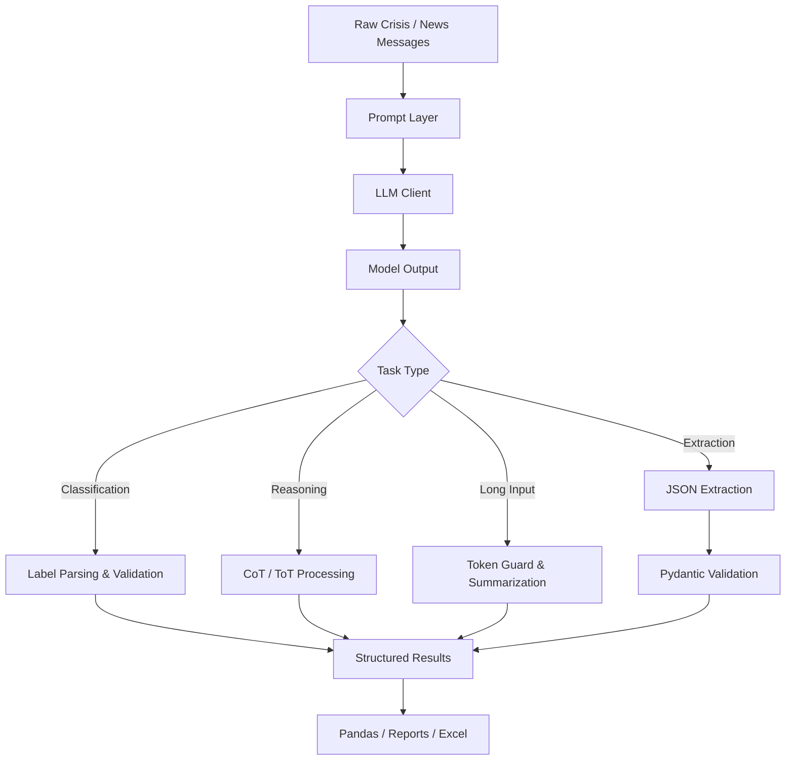

# Crisis Intel AI

> A notebook-based AI engineering project for building a reliable crisis-intelligence pipeline with prompt engineering, structured reasoning, token control, validation, and configurable LLM routing.

## Overview

**Crisis Intel AI** explores how Large Language Models can be used safely and systematically to process unstructured crisis reports.

Rather than treating the LLM as a standalone chatbot, this project wraps model calls with engineering controls such as:

- few-shot classification
- structured reasoning
- multi-strategy comparison
- temperature/stability testing
- token-budget enforcement
- prompt versioning
- configuration-driven model routing
- structured JSON extraction
- deterministic Pydantic validation
- report generation with Pandas and Excel

The project is implemented as a set of Jupyter notebooks supported by reusable utilities under `utils/`.

> **Important:** This is an educational prototype built with sample crisis data. Model outputs must be reviewed before any real-world operational use.

---

## What This Project Demonstrates

| Part | Engineering Problem | Technique | Main Output |
|---|---|---|---|
| **1. Crisis Message Classification** | Convert noisy messages into machine-readable categories | Few-Shot Prompting | `output/classified_messages.xlsx` |
| **2. Stability Experiment** | Study how model randomness affects reasoning | CoT + Temperature Testing | `output/stability_experiment.md` |
| **3. Logistics Commander** | Score incidents and compare rescue strategies | CoT + Tree of Thought | `output/logistics_commander.md` |
| **4. Budget Keeper** | Control excessive prompt size and preserve useful information | Token Counting + Summarization | `output/budget_keeper.md` |
| **5. News Extraction Pipeline** | Convert raw reports into validated structured records | JSON Extraction + Pydantic | `output/flood_report.xlsx` |

---

## System Design



A central design principle of the project is:

```text
Probabilistic LLM
        +
Deterministic Validation
        +
Explicit Constraints
        =
More Reliable AI Workflow
```

---

# Project Modules

## 1. Crisis Message Classification

Notebook:

```text
notebooks/classifier.ipynb
```

The classifier processes **50 sample crisis messages** and extracts:

```text
District
Intent
Priority
```

Supported intents:

```text
Rescue
Supply
Info
Other
```

Priority:

```text
High
Low
```

Example output:

```text
District: Gampaha | Intent: Rescue | Priority: High
```

### Engineering ideas demonstrated

- Few-shot examples as behavioral guidance
- strict output contracts
- allowed-value validation
- centralized district configuration
- parsing LLM output before downstream use

Output:

```text
output/classified_messages.xlsx
```

---

## 2. Temperature Stability Experiment

Notebook:

```text
notebooks/stability_test.ipynb
```

The same crisis scenarios are executed with:

```text
temperature = 1.0  -> Chaos Mode, 3 runs
temperature = 0.0  -> Safe Mode, 1 run
```

The experiment compares:

- final decision stability
- unsupported assumptions
- reasoning drift
- hallucinated details
- consistency between repeated runs

### Key learning

A model can produce the **same final answer while using less reliable reasoning**.

Therefore, evaluation should not only ask:

```text
"Was the final answer correct?"
```

but also:

```text
"Was the answer grounded in the provided evidence?"
```

Output:

```text
output/stability_experiment.md
```

---

## 3. Logistics Commander

Notebook:

```text
notebooks/rescue_planning.ipynb
```

This module has two stages.

### Stage A — Incident Scoring with CoT

A rule-based scoring process is applied:

```text
Base Score = 5
+2 if age > 60 or age < 5
+3 if Need == Rescue
+1 if Need == Insulin / Medicine
```

Example results:

| Area | Need | Score |
|---|---|---:|
| Gampaha | Water | 5 |
| Ja-Ela | Insulin | 8 |
| Ragama | Rescue | 8 |

### Stage B — Strategy Comparison with ToT

Three strategy branches are explored:

1. Highest-priority first
2. Closest first
3. Furthest first

Travel information is treated as **directional**. The model may derive a route only when the path can be constructed from known segments.

Example:

```text
Ragama -> Ja-Ela = 10 min
Ja-Ela -> Gampaha = 40 min
```

Therefore:

```text
Ragama -> Gampaha = 50 min
```

can be derived, but an unknown reverse route is not assumed.

### Engineering ideas demonstrated

- CoT for structured scoring
- ToT for exploring multiple strategies
- structured intermediate data between AI stages
- explicit constraints to reduce hallucinated assumptions
- separating derivation from invention

Output:

```text
output/logistics_commander.md
```

---

## 4. Budget Keeper

Notebook:

```text
notebooks/budget_keeper.ipynb
```

The Budget Keeper protects the pipeline from excessively long inputs.

```text
Token limit = 150
```

Flow:

```text
Input Message
     |
     v
Count Tokens
     |
     +---- <= 150 ----> ALLOWED
     |
     +---- > 150 -----> BLOCKED/TRUNCATED
                              |
                              v
                    overflow_summarize.v1
```

The summarizer removes repetition and chain-message noise while attempting to preserve:

- location
- victim information
- urgency
- emergency need
- medical information

Example experiment:

```text
Original tokens : 706
Processed tokens: 38
Status          : BLOCKED/TRUNCATED
```

### Engineering ideas demonstrated

- token-aware system design
- context-window management
- cost/latency awareness
- information-preserving compression

Output:

```text
output/budget_keeper.md
```

---

## 5. Structured News Extraction

Notebook:

```text
notebooks/news_extraction.ipynb
```

The pipeline processes **30 mixed news/crisis reports** and extracts structured events.

Schema:

```json
{
  "district": "Gampaha",
  "flood_level_meters": 2.0,
  "victim_count": 500,
  "main_need": "dry rations",
  "status": "Critical"
}
```

Processing flow:

```text
Raw News Line
     |
     v
json_extract.v1
     |
     v
LLM JSON Output
     |
     v
CrisisEvent.model_validate_json()
     |
     +---- valid ----> DataFrame
     |
     +---- invalid --> warning / rejection
                         |
                         v
                    Excel Report
```

### Engineering ideas demonstrated

- schema-driven extraction
- JSON-only output contracts
- Pydantic validation
- centralized district configuration
- safe handling of missing/uncertain information
- transforming AI output into analytics-ready data

Output:

```text
output/flood_report.xlsx
```

---

# Prompt Registry

Prompt templates are centralized in:

```text
utils/prompts.py
```

Current prompt strategies include:

```text
zero_shot.v1
few_shot.v1
cot_reasoning.v1
tot_reasoning.v1
overflow_summarize.v1
json_extract.v1
```

Centralizing prompts makes it easier to:

- reuse prompts across notebooks
- version prompt behavior
- compare experiments
- reduce duplicated prompt strings
- update prompt logic without spreading changes throughout the project

---

# Model Routing

Models are configured in:

```text
config/models.yaml
```

Routing behavior is handled by:

```text
utils/router.py
```

The system separates model tiers into:

```text
general
strong
reason
```

This allows simpler tasks to use general models while reasoning-heavy tasks can be routed to stronger models.

The repository currently contains provider configurations for:

- Groq
- OpenAI
- Google Gemini

The notebooks are currently configured primarily for **Groq**.

---

# Configuration-Driven Design

Common settings are stored in:

```text
config/config.yaml
```

This includes:

- model-routing categories
- default temperatures
- default token limits
- task-specific generation settings
- Sri Lankan district names

Example:

```yaml
defaults:
  by_task:
    extraction:
      temperature: 0.0
      max_tokens: 500

    reasoning:
      temperature: 0.3
      max_tokens: 2000
```

This avoids scattering important settings across notebooks and provides a single source of truth.

---

# Repository Structure

```text
crisis-intel-ai/
│
├── config/
│   ├── config.yaml
│   └── models.yaml
│
├── data/
│   ├── sample_messages.txt
│   ├── Scenarios.txt
│   ├── Incidents.txt
│   └── news_feed.txt
│
├── notebooks/
│   ├── classifier.ipynb
│   ├── stability_test.ipynb
│   ├── rescue_planning.ipynb
│   ├── budget_keeper.ipynb
│   └── news_extraction.ipynb
│
├── output/
│   ├── classified_messages.xlsx
│   ├── stability_experiment.md
│   ├── logistics_commander.md
│   ├── budget_keeper.md
│   └── flood_report.xlsx
│
├── utils/
│   ├── config_loader.py
│   ├── json_utils.py
│   ├── llm_client.py
│   ├── prompts.py
│   ├── router.py
│   └── token_utils.py
│
├── LEARNING_LOG.md
├── pyproject.toml
├── requirements.txt
├── uv.lock
└── README.md
```

---

# Core Utilities

| Utility | Responsibility |
|---|---|
| `config_loader.py` | Loads centralized YAML configuration |
| `router.py` | Routes tasks to configured model tiers |
| `prompts.py` | Stores and renders versioned prompts |
| `llm_client.py` | Provides a shared interface for model providers |
| `token_utils.py` | Estimates message/context token usage |
| `json_utils.py` | Supports JSON extraction and validation workflows |

---

# Getting Started

## Requirements

- Python **3.12+**
- Jupyter
- An API key for the model provider you want to use

The easiest setup uses [`uv`](https://docs.astral.sh/uv/).

---

## 1. Clone the Repository

```bash
git clone https://github.com/AmiruHoradagoda/crisis-intel-ai.git
cd crisis-intel-ai
```

---

## 2. Install Dependencies

Using `uv`:

```bash
uv sync
```

Alternatively:

```bash
pip install -r requirements.txt
```

---

## 3. Configure Environment Variables

Create a `.env` file in the repository root.

For the current Groq-based notebook setup:

```env
GROQ_API_KEY=your_groq_api_key
```

The shared LLM client also supports provider keys for OpenAI and Google Gemini when using those providers.

> Never commit real API keys to Git.

---

## 4. Launch Jupyter

The notebooks use paths such as:

```text
../data/
../output/
```

so launch Jupyter from the `notebooks` directory.

### Windows

```powershell
cd notebooks
..\.venv\Scripts\jupyter.exe lab
```

### macOS / Linux

```bash
cd notebooks
../.venv/bin/jupyter lab
```

Select the project's Python environment as the notebook kernel.

---

# Recommended Run Order

Run the notebooks in the same order as the learning workflow:

```text
1. classifier.ipynb
2. stability_test.ipynb
3. rescue_planning.ipynb
4. budget_keeper.ipynb
5. news_extraction.ipynb
```

Each notebook can also be explored independently.

---

# Technology Stack

### AI / LLM

- Groq
- OpenAI-compatible APIs
- Google Gemini support
- Prompt Engineering
- Few-Shot Prompting
- Chain of Thought
- Tree of Thought

### Python / Data

- Python 3.12+
- Pydantic
- Pandas
- OpenPyXL
- PyYAML
- python-dotenv

### LLM Engineering

- tiktoken
- configurable model routing
- token budgeting
- JSON validation
- prompt versioning

### Development

- Jupyter
- uv
- pytest
- Black
- Flake8
- mypy

---

# Engineering Lessons

This project reinforced several practical principles for building LLM applications:

### 1. Treat model output as untrusted input

LLM output should be parsed and validated before it is used by another component.

### 2. Prefer structured handoffs between AI stages

Passing dictionaries/JSON between stages is more reliable than passing ambiguous free-form reasoning text.

### 3. Do not invent missing information

When data is unavailable, representing uncertainty is often safer than guessing.

### 4. Use deterministic components around probabilistic models

Examples:

```text
LLM -> Pydantic validation
LLM -> allowed-value parser
LLM -> token guard
```

### 5. Model choice is an engineering decision

Not every task requires the strongest model. Routing simpler tasks to smaller models can reduce cost and latency.

### 6. Token cost is part of system architecture

Prompt size affects:

- inference cost
- latency
- context-window usage
- scalability
